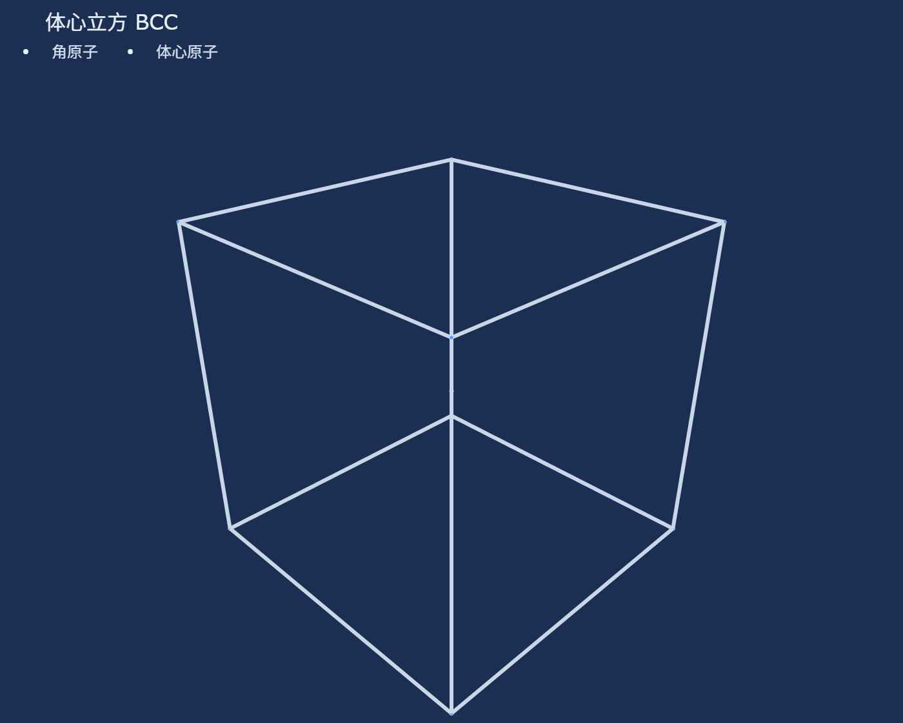
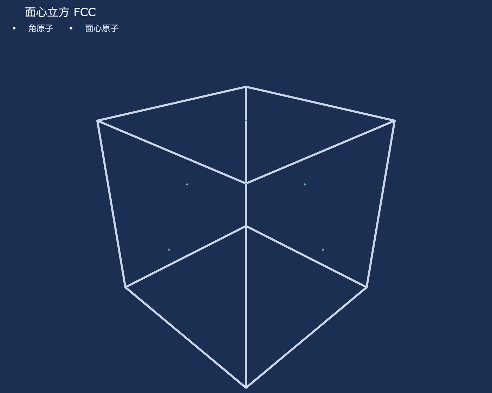
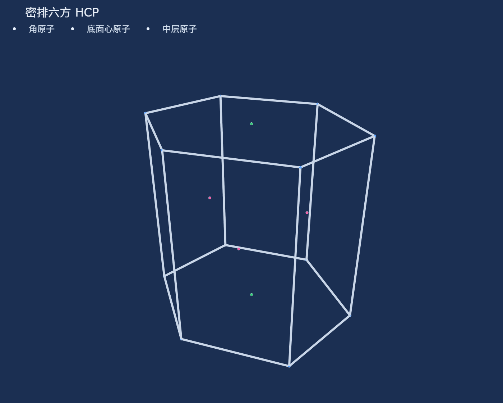
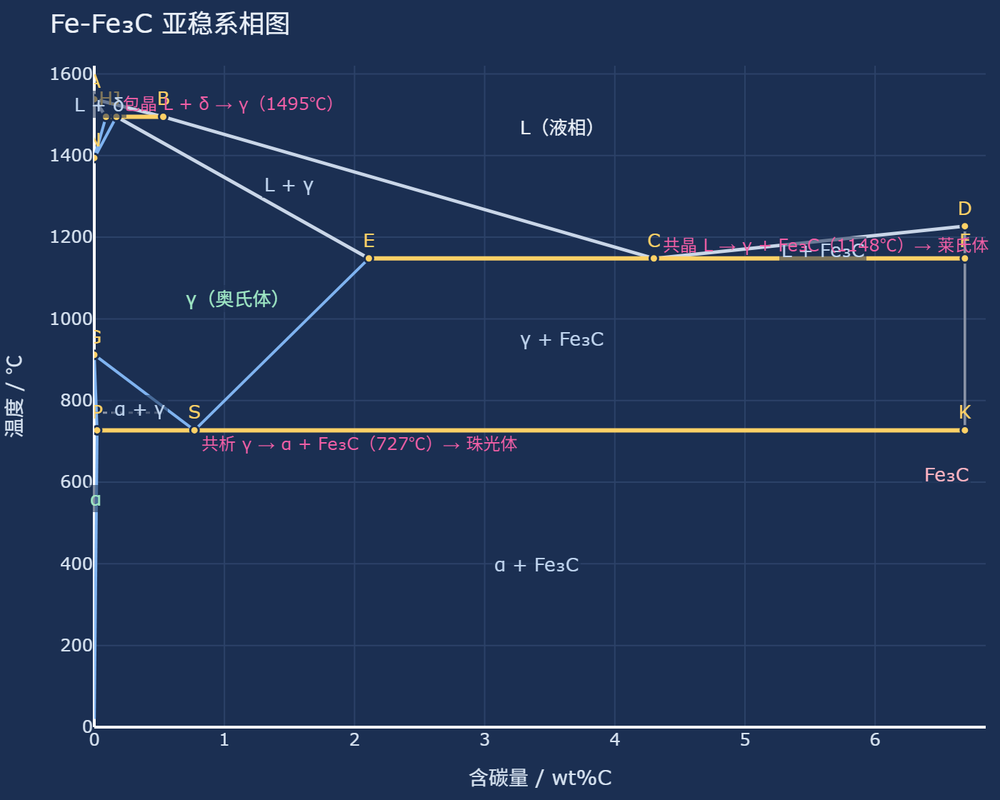
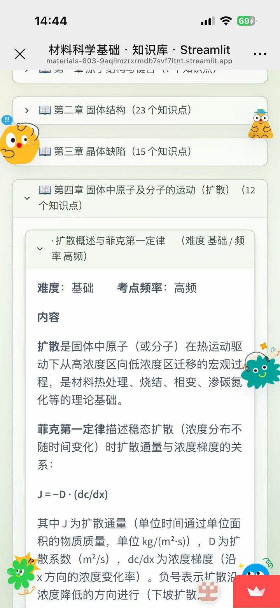
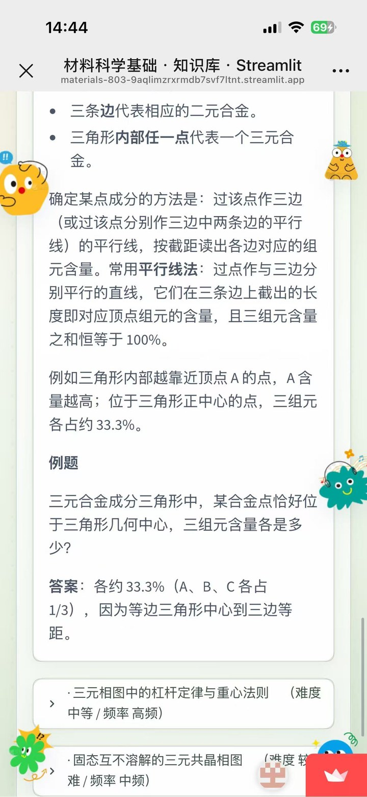
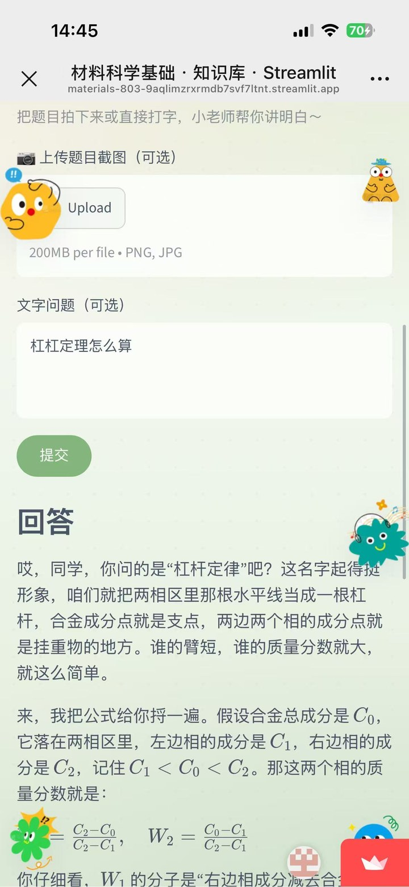

# 材料科学基础 · AI 学习助手

> 一个**结合《材料科学基础》考研知识库的 AI 学习助手**——不是普通聊天机器人，而是一位「有教材、能溯源、会算题、会画图」的备考伙伴。

面向材料类考研（如 803《材料科学基础》）学生，把**结构化知识点卡片库**、**检索增强问答（RAG）**、**交互式可视化**与**大语言模型**结合在一起：AI 的每一次回答都基于知识库里真实存在的知识点，可一键定位到原文卡片，而不是凭空生成。

---

## 🌐 快速体验

| 入口 | 链接 |
|---|---|
| 🚀 **在线体验（点开即用）** | https://materials-803-9aqlimzrxrmdb7svf7ltnt.streamlit.app/ |
| 📦 **GitHub 源码** | https://github.com/1111178/materials-803 |

> 手机、电脑浏览器直接打开即可使用，无需安装任何东西。

---

## 项目背景

《材料科学基础》是材料、冶金等专业考研的核心专业课，知识点多、体系庞大，其中**相图、晶体结构、扩散、相变**等章节抽象难懂，计算题（如杠杆定律、相组成物/组织组成物）更是丢分重灾区。

而通用聊天机器人存在一个致命问题：**幻觉**。它们会"一本正经地胡说八道"，给出的公式、数值、概念很可能出错，对于需要精确答案的考研复习来说不可信赖。

本项目希望解决这个矛盾——**让 AI 的回答"有据可查"**：先建立一份高质量、结构化的专业课知识库，再用检索增强（RAG）技术，让大模型基于检索到的真实知识点作答，并附上原文出处。同时针对材料科学的独有痛点，加入 3D 晶体结构、铁碳相图、可执行计算题等**可视化与可交互**能力，把抽象概念变成看得见、点得动的东西。

---

## 目标用户

- **备考《材料科学基础》的考研学生**（核心用户）：随时查知识点、刷计算题、看晶体和相图。
- **需要快速复习、查漏补缺的同学**：利用知识地图按章节导航、用关键词秒查。
- **可扩展的辅助场景**：材料类课程的日常教学、答疑、自测。

---

## 核心功能

| 功能 | 说明 |
|---|---|
| 🗺️ **知识地图** | 按章节（10 章）导航，支持关键词搜索，点开即看知识点卡片 |
| 💬 **智能问答（RAG）** | BM25 检索 + 大模型生成，**回答附带检索到的原文卡片**，可溯源 |
| 🧮 **计算题自动执行** | 杠杆定律等计算题由 Python 精确计算，展示可读步骤与结果 |
| 🖼️ **图片 OCR** | 上传题目截图，自动识别题干再作答（Qwen-VL / Claude 多模态 / GLM-4V） |
| 🔮 **3D 晶体结构可视化** | 体心立方 / 面心立方 / 密排六方，可旋转缩放、悬停看原子坐标 |
| 🌡️ **铁碳相图** | Fe-Fe₃C 亚稳系相图交互展示，标注关键点、三相反应与相区 |
| 🎯 **闯关练习** | 随机抽题自测，检验掌握程度 |

---

## 📸 项目截图

<div align="center">

**3D 晶体结构可视化**（左→右：体心立方 BCC / 面心立方 FCC / 密排六方 HCP，可拖拽旋转、缩放）





**Fe-Fe₃C 亚稳系铁碳相图**（交互标注关键点、三相反应与相区）



</div>

**应用界面**（左→右：首页/知识地图 · 智能问答带溯源 · 图片 OCR）

<div align="center">





</div>

---

## 技术架构

整体是一个 **Streamlit 单页应用**，前端交互、检索、模型调用、可视化全部由 Python 驱动，部署零后端服务器成本。

```
┌─────────────────────────────────────────────────────────┐
│                     Streamlit 前端                        │
│   知识地图 · 智能问答 · 图片OCR · 3D可视化 · 闯关练习     │
└───────────────┬───────────────────────┬─────────────────┘
                │                       │
        ┌───────▼────────┐      ┌───────▼────────┐
        │  知识库层（离线）│      │   模型服务层（在线）│
        │  Markdown 卡片  │      │  DeepSeek / Claude│
        │  BM25 检索      │      │  Qwen-VL / GLM-4V │
        │  同义词扩展      │      │  （可切换）        │
        └───────┬────────┘      └─────────────────┘
                │                        │
                └──────────┬─────────────┘
                           ▼
                    检索增强生成（RAG）
              「检索卡片 → 注入上下文 → 生成答案 → 引用出处」
```

**关键技术选型**：

| 层 | 技术 |
|---|---|
| UI / 应用框架 | Streamlit |
| 检索 | BM25 关键词检索 + 题型同义词扩展 |
| 大模型 | DeepSeek / Claude（可切换，密钥走环境变量或 Secrets） |
| 多模态 | Qwen-VL / Claude 多模态 / GLM-4V（图片 OCR） |
| 可视化 | Plotly（2D 铁碳相图 + 3D 晶体结构） |
| 计算 | Python 数值计算（杠杆定律等） |
| 部署 | GitHub + Streamlit Cloud，密钥走 Secrets，代码零泄漏 |

---

## 知识库构建方法

知识库是整套系统的**核心资产**，决定了 AI 回答的质量下限。它采用「**结构化知识点卡片**」的形式，而非散乱的文本：

- **组织方式**：按教材 10 章拆分，每章一个 Markdown 文件（`kb/` 目录）。
- **卡片结构**：每张卡片统一包含 `知识点标题`、`章节`、`难度`、`考点频率`、`内容`、`例题 + 答案`，部分还含 `易错点` 与 `知识点标签`。
- **规模**：共 **136 张卡片**，覆盖晶体结构、缺陷、扩散、相图、相变、力学性能等核心内容。
- **重难点专题**：对考研重难点（如「铁碳合金相图」）做**深度补充**——既有一组概念卡（铁素体/奥氏体/渗碳体/莱氏体/A1-A3-Acm 线/钢与铸铁区分），也有成套的计算题卡（杠杆定律求相组成物、组织组成物、判断相与组织、室温组织相对量）和画图指导卡。
- **计算题的可执行性**：计算题数值由 Python 精确计算，保证结果正确，展示时只保留可读的"题目 → 已知 → 公式 → 分步解答 → 答案 → 易错点"过程。

**构建理念**：卡片既是人可读的复习资料，也是检索系统（BM25）和问答系统（RAG）的**结构化证据源**——用户点开卡片能自学，AI 答题时则把这些卡片作为"参考书目"注入上下文，做到**回答可溯源、内容可维护、知识点可增量扩充**（新增知识点只需往 `kb/` 里加一个 Markdown 卡片，无需改代码）。

---

## 使用说明

### 在线访问（推荐给使用者）

**https://materials-803-9aqlimzrxrmdb7svf7ltnt.streamlit.app/**

手机、电脑浏览器直接打开即可使用，无需安装任何东西。

### 本地运行（开发者）

```bash
pip install -r requirements.txt
streamlit run app.py
```

浏览器打开 `http://localhost:8501`。API Key 可在侧边栏「高级设置」中填写（保存在本地 `.config.json`，不会上传）。

### 配置大模型密钥

在 Streamlit Cloud 的 **Settings → Secrets** 中配置（二选一即可，也可以由访客在网页侧边栏手动填）：

```toml
DEEPSEEK_API_KEY = "你的 DeepSeek Key"
ANTHROPIC_API_KEY = "你的 Claude Key"
DASHSCOPE_API_KEY = "你的 Qwen-VL Key"   # 图片 OCR
ZHIPUAI_API_KEY = "你的 GLM-4V Key"       # 图片 OCR
```

> 密钥统一走环境变量 / Secrets，`.config.json` 与 `.streamlit/secrets.toml` 已加入 `.gitignore`，**不会**被提交到公开仓库。

---

## 项目亮点

1. **不是普通聊天机器人，而是"知识库 + 检索增强"的学习助手**：AI 回答前先检索知识库，把命中的知识点卡片作为上下文，因此**答案有依据、可溯源**，从根上缓解大模型的幻觉问题。

2. **结构化、可维护的知识库**：知识点以统一格式的卡片沉淀，既是学习资料、又是检索证据源，还能**零代码增量扩充**。

3. **针对材料科学的专属可视化**：3D 晶体结构（BCC/FCC/HCP）可旋转缩放，铁碳相图（Fe-Fe₃C）交互标注关键点与三相反应——把教材上最抽象的部分变成可交互的图形。

4. **计算题真正"会算"**：杠杆定律等计算题由 Python 精确求解，输出可读的分步过程，而不是大模型"估算"出的一个可能错误的数字。

5. **移动端友好**：3D 模型采用懒加载、铁碳相图默认折叠，手机浏览器也能流畅使用。

6. **全栈自主、零成本部署**：纯 Python 技术栈，借力 Streamlit Cloud 免费托管，学生拿到链接即可使用，无需自建服务器。

> 📖 技术实现细节、踩坑记录与取舍，见 **[docs/技术难点.md](docs/技术难点.md)**。

---

## 未来规划

- **题库扩充**：继续扩充更多章节的考点卡片与计算题，覆盖更全面的真题题型。
- **个性化复习**：基于学习记录与闯关练习，生成错题本与薄弱知识点清单，制定个性化复习路径。
- **更多可视化**：相变过程动画、晶体缺陷（位错/晶界）三维示意、扩散过程演示。
- **语音交互**：支持语音提问与朗读解析，进一步降低使用门槛。
- **多端体验**：推出更适合手机的小程序 / 移动端版本，提升随时随地的复习体验。
